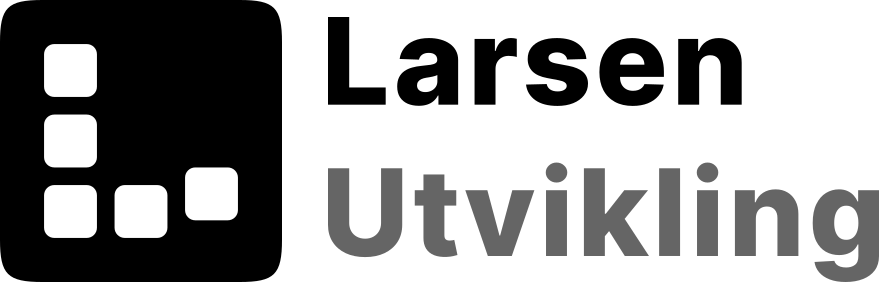
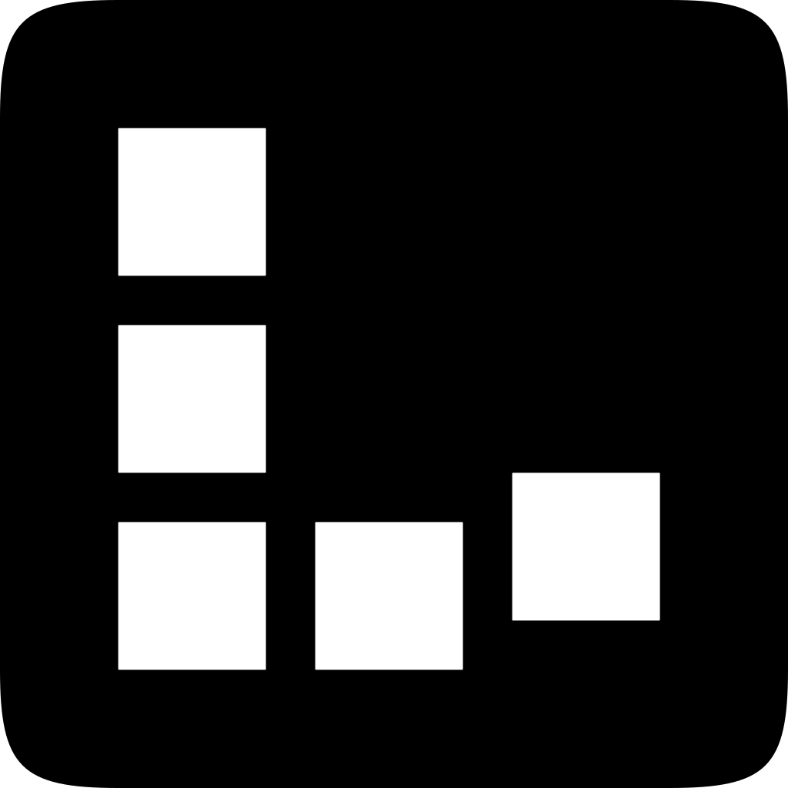

<p align="center">
  <picture>
    <source media="(prefers-color-scheme: dark)" srcset="public/larsen-utvikling/logo-name-dark.svg">
    
  </picture>
</p>

# {{APP_NAME}}

Built with the Larsen Utvikling Next.js template: newest stable Next.js,
App Router, TypeScript, and a vanilla CSS design system. No Tailwind, no
CSS framework - just tokens.

## Getting started

```bash
{{PM}} install
{{PM_RUN}} dev
```

Open http://localhost:3000 and start editing `src/app/page.tsx`.

## Scripts

| Command | Description |
| --- | --- |
| `{{PM_RUN}} dev` | Development server |
| `{{PM_RUN}} build` | Production build |
| `{{PM_RUN}} start` | Serve the production build |

## Structure

```
src/
  app/                    App Router routes and layouts
    globals.css           Single import of the design system
    page.tsx              Welcome page - replace it
  lib/design-system/
    index.css             Entry point
    core.css              Spacing, widths, radii, motion, z-index
    theme.css             Colors (light + dark) + app bridge tokens
    base.css              Reset + document defaults
public/larsen-utvikling/  Brand assets
```

Docs: `DESIGN.md` (token reference), `AGENTS.md` (project rules for AI
agents), `NEXTJS.md` (Next.js agent guide).

## After scaffolding - checklist

- [ ] Replace the favicon (`src/app/favicon.ico`)
- [ ] Update metadata in `src/app/layout.tsx` (title, description)
- [ ] Tweak the palette in `src/lib/design-system/theme.css` if needed
- [ ] Add project-specific rules to `AGENTS.md`
- [ ] Create `.env.local` if the project needs environment variables
- [ ] Add an Open Graph image (`src/app/opengraph-image.png`)

## Tech

Next.js (newest at scaffold time) - TypeScript - App Router - vanilla CSS
design tokens

---

<p>
  <a href="https://www.larsenutvikling.no">
    <picture>
      <source media="(prefers-color-scheme: dark)" srcset="public/larsen-utvikling/logo-dark.svg">
      
    </picture>
    Built by Stian Larsen - Larsen Utvikling
  </a>
</p>
